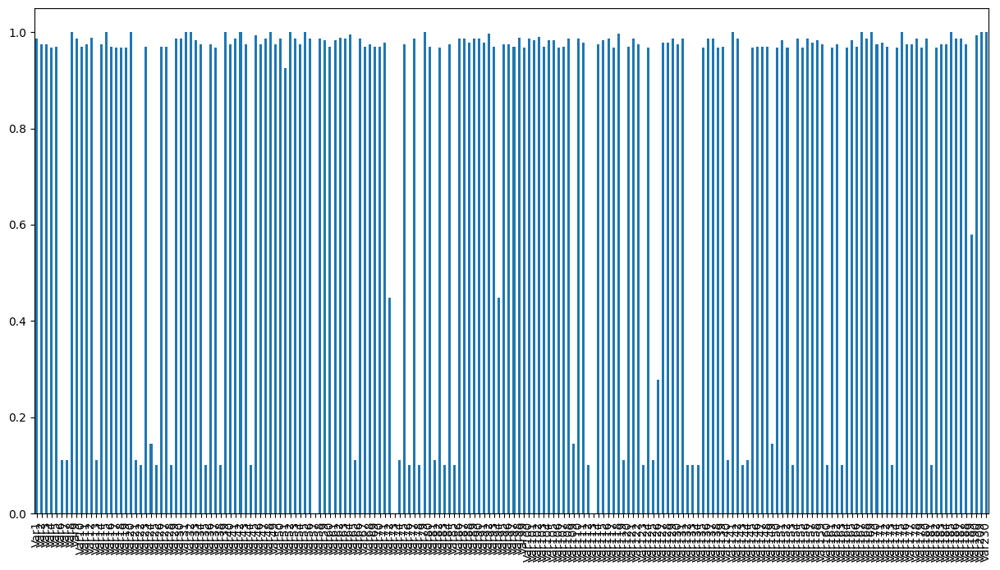
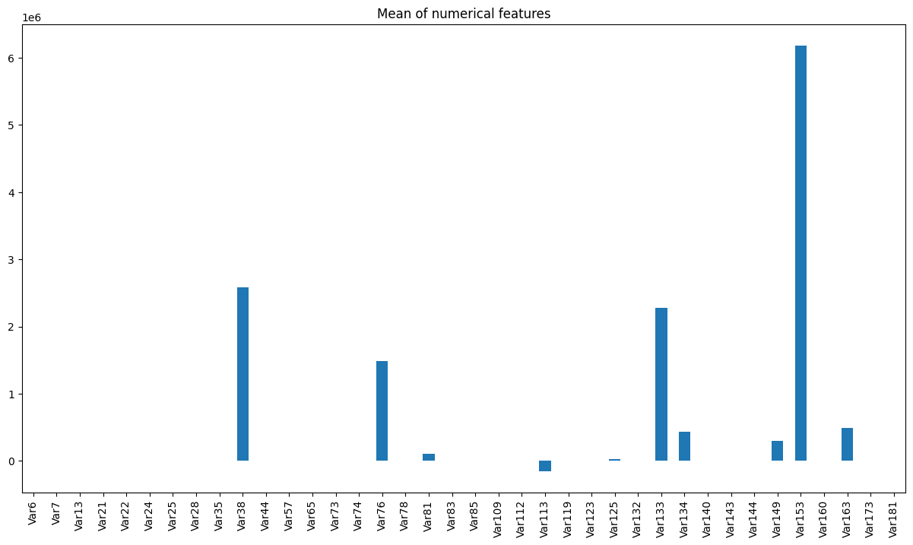
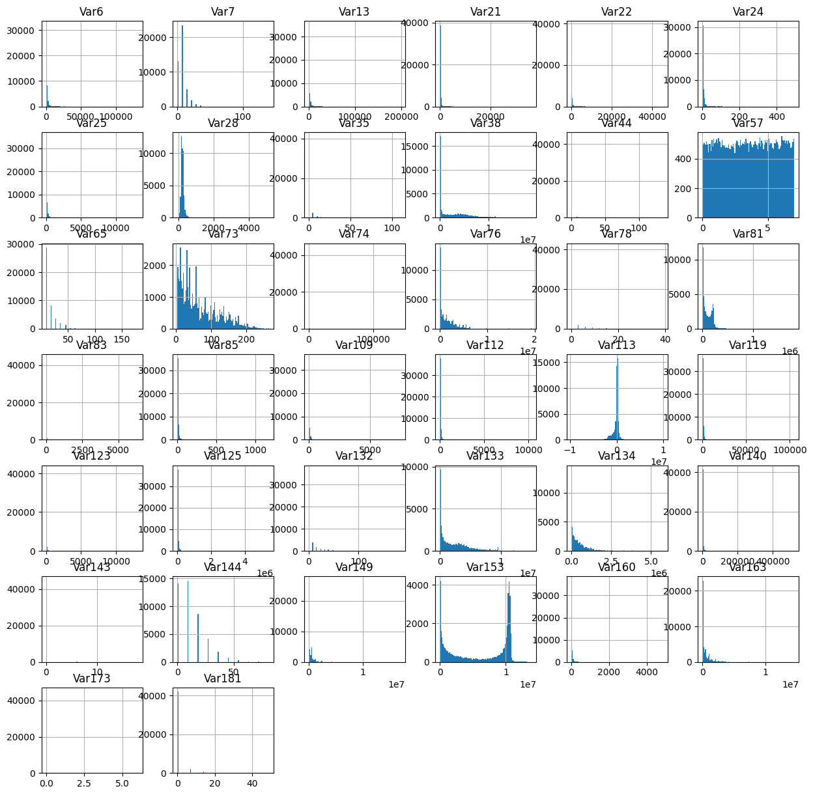
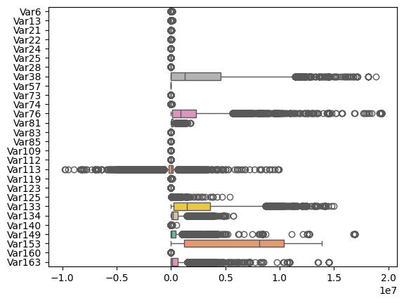
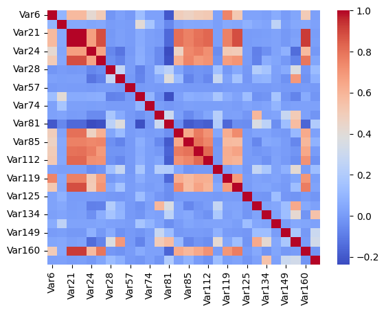

# Documenting the Data Science process

Task statement explicitly mentions the dataset is provided for **classification** task. 
<!-- 
# Steps

Classification problem -->

# Data Exploration:
The dataset is split into two files. 
1) **Features:** train (6).csv
2) **Labels:** train_churn_labels.csv

This task does not provide information about the domain and context of the problem. There is no description of the variables in dataset. Lack of this information poses a glaring challenge in choosing the features/variables for prediction. In such cases we need to incorporate lot of assumptions about dataset for modeling task. We will perform EDA to identify the features that would be useful for model building based on statistical analysis.  

## Feature Dataset
The dataset has 50,000 data points (rows). The features file contained features/variables, that could be used for predicting the labels. It has 230 columns named from Var1, Var2, ... , Var230.   

The dataset contained both numeric and string data. Let's split the features in numeric and string to perform univariate and multivariate analysis.

|Number of numerical features|Number of non-numeric feature|
|-|-|
|192|38|

We will explore numeric and non-numeric features separately.

## EDA on Numerical Features
This section we will perform the EDA on 192 numerical features in dataset. The following analytical steps are performed 

- Univariate
- Missing values
- Outliers
- Bivariate

### Missing values
The figures shows a bar plot of proportion of missing values (Y axis) for each feature. It can be seen that dataset is plagued by missing values. And according the paper in Reference [1], for classification problems, it is possible to handle up to 20% of missing values. 

Let's drop the features with more than 20% missing values. This resulted in **38 numerical features out of 192** that are qualified for developing a classification model.

**The missing values in 38 features shall be handled by mean imputation.**

### Univariate Analysis

Lets start by looking into the mean each feature, to understand the scale of values that each feature operates on.

This bar plot shows that some features operate on very high scale than others. When certain features operate on higher scale than other, they tend to have more influence on the prediction of classification labels. This impacts the performance of ML algorithms. Having the features operating on same scale will lead to fair use of all features for prediction. This plot suggests that we need to **apply re-scaling techniques on the features to makes sure they are on the same scale**.  

#### Data Distirbution

Lets examine the distribution fo each variable by plotting the histogram. 

The plot reveals some interesting facts about data. 
- None of the features is normally distributed. 
- Var113 is only feature close to normal.
- Var57 is uniformly distributed
- Few of features seems to take only few values. These may come from categorical features encoded numerically. 

The dataset contains 50,000 data points. It's fair to make an assumption, **the features that has less than 20 unique values are categorical**.

Apply the above criteria and separate these features. This resulted in **10 categorical features from 38 numerical feature**.

Until this point we have identified **28 numerical feature and 10 categorical features** from 192 numerical features that are useful for modeling task.

### Outliers
Outliers are the data points that deviate significantly from the rest of dataset and could indicate data quality issues. We will use the Inter Quartile Range (IQR) for analysing the outlier in the dataset.

$$IQR = Q3 - Q1$$

- Q3 = the 75th percentile value (it is the middle value between the median and the largest value inside a dataset). 
- Q1 = the 25th percentile value

Box-plot can be used to visualize the IQR and analyze the data.

Box plot shows the data has outliers. The presence of outliers is high on several features such as Var113, Var76 etc. 

### Bivariate analysis
We can perform the co-relation analysis on the numerical features. 

#### Correlation analysis

Correlation shows the strength and direction of relationships between numerical data. Pearson correlation coefficient is the method to compute the correlation between two continuous variables.

We compute the correlation between each numerical features. The result is in the form of matrix, where each element in matrix is the pearson correlation coefficient computed between row variable and column variable. This result correlation matrix is plotted as heatmap for the purpose of analysis. 

The diagonals elements exhibit strong correlation as it's correlation with the same variable. 

We can observer few red shaded region which shows the **cluster of variables that are co-related**. Each cluster represents multiple pair of variables that shows high correlation. Correlated variables carry redundant information. In case we wanted to reduce the dimension of the model, we can use this information pick one of the variables from pair of correlation variable.

## EDA on non numeric Features
Non-numerical feature in the dataset are features that contains text or combination of text and numbers in some cases. As ML algorithms (except LLMs) expect the input features to be numeric in nature. It's responsibility of the Data Scientist to transform these to numeric data. In case the text feature contains meaningful sentences that had useful information for prediction, then we can transform such text with NLP techniques. In other cases the text is short and it represents the identity of the entity that generated the data or purely represents the categorical information. In this cases the text shall be treated as categories.

The description of these categorical data is missing, so it safe to treat these categorical variables as nominal(no intrinsic order to categories). It can be transformed numerical value using strategy like one-hot encoding.

Our dataset has 38 non-numeric features out of 230 features.

**Missing values**
Many non-numeric features has very high proportion of missing values. Applying the same rule as numeric for handling missing values. Drop the features with more than 20% missing values. Applying the rule results in 28 features.

**Number of Categories**
Several non-numeric feature has very large number of unique values, these cannot be attributed as categorical feature. Treating such feature as categories and applying one-hot encoding would result in the additional number of columns as number of categories. Increasing the dimensions is usually results in bad model performance.

We will apply same rule as Numerical features, i.e we will treat features that contains less than 20 unique values as numeric. This results in **11 categorical features**.

## Label Dataset
The labels file contains the labels corresponding to data point in features file. It had only **two distinct integer labels 1 and -1**. We are dealing with **binary classification** problem.

92% of labels belong to negative class and 8% to positive class. We are dealing with **highly imbalanced dataset**.  

# Feature Engineering
The feature engineering is the process of creating new features that are not in the input dataset. One must possess the knowledge about the process that generated the data. Since it's not available we cannot apply feature engineering process in this task.

# Conclusion:
- The dataset is highly imbalanced. 92% of labels belong to negative class and 8% to positive class.
- The dataset has 192 numerical features and 38 non-numeric features. 
- **Data Processing steps and assumptions:**
    - Dropping the features with more than 20% missing data results in 
        - Numeric : 38 features
        - Non numeric: 28 features
        
        The missing values in 38 numerical features shall be handled by mean imputation. For non-numeric it shall be handled by KNN based imputation.
    - Segregating categorical features from numeric
        - Numeric: 28 
        - Categorical numeric: 10 
    - Filtering valid categorical feature from non-numeric
        - Categorical features: 11
    - Outliers are handled by removing the rows of each numerical features that lie outside Inter Quartile Range
    - Categorical values are one-hot encoded
    - Rescale numerical values
- Split data into training and test dataset.
- **Models:** Train the following models
    - Logistic Regression, 
    - DecisionTrees, 
    - RandomForest, 
    - XGBoost, 
    - GradientBoosting 
- Use GridSearcCV for selecting the hyperparameter for each model.
- **Evaluation Metric**: Since the dataset is highly imbalanced, we shall use F1 score for evaluating the model. F1 score by definition is the harmonic mean for precision and recall. Since we don't know the background of the problem and context of application we cannot determine how wrong predictions affect our customer. F1 score is suited for this scenario as it equally punishes False Positives and False Negatives.
- Select the model and hyperparameter configuration that has the high F1 score.
- **Future work: If the above models does not meet the required performance** 
    - Correlated features could negatively impact the model performance. Use the result correlation analysis to remove the highly correlated features.  
    - Revise the assumptions made in data processing steps (like changing strategy for handling categorical variables, rescaling numeric variables, missing values and outliers)
    - Try Multi Layer Perceptron (MLP) based deep learning architecture. 

# References
[1] The treatment of missing values and its effect in the classifier accuracy. Edger A, Caroline R 